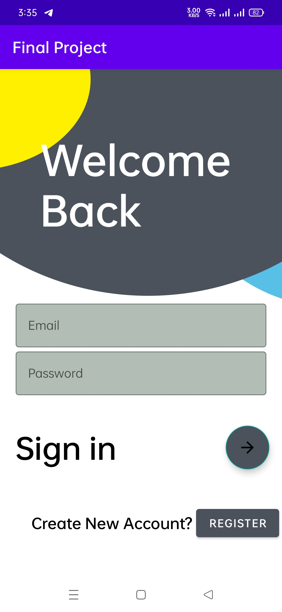
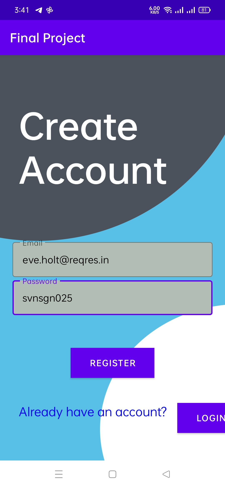
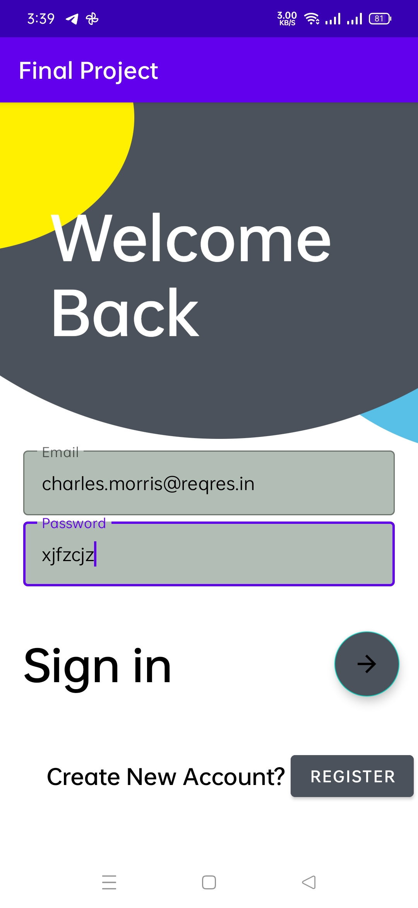
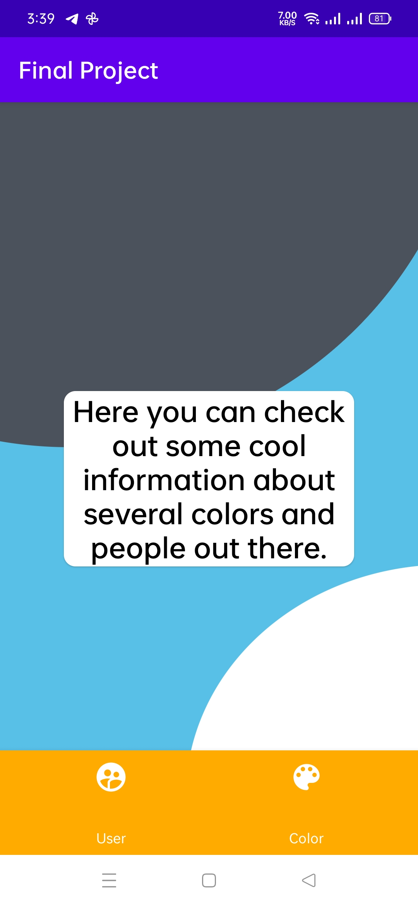
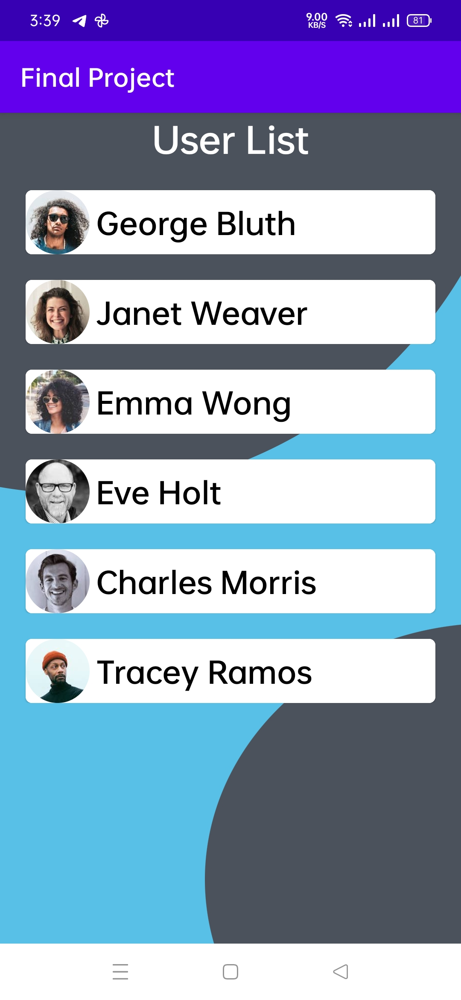
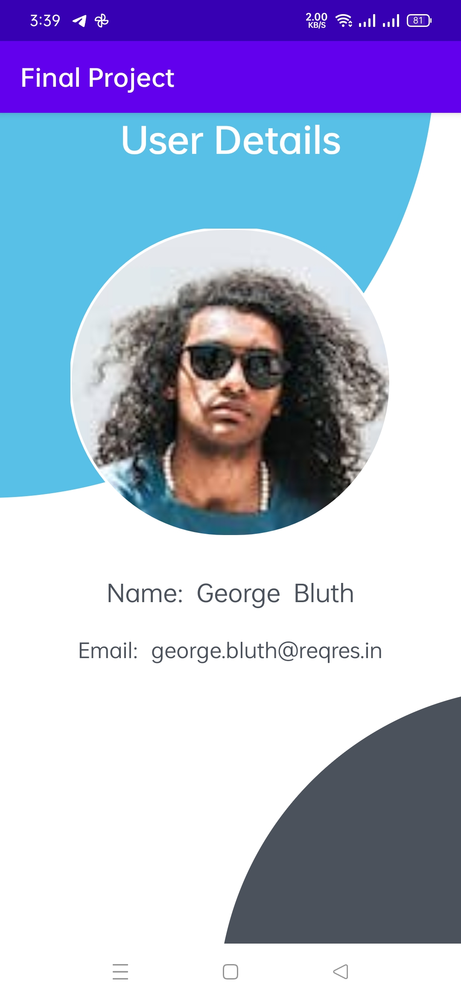
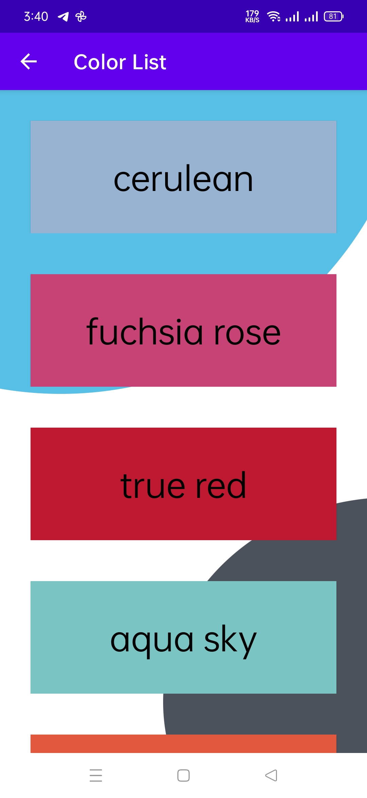
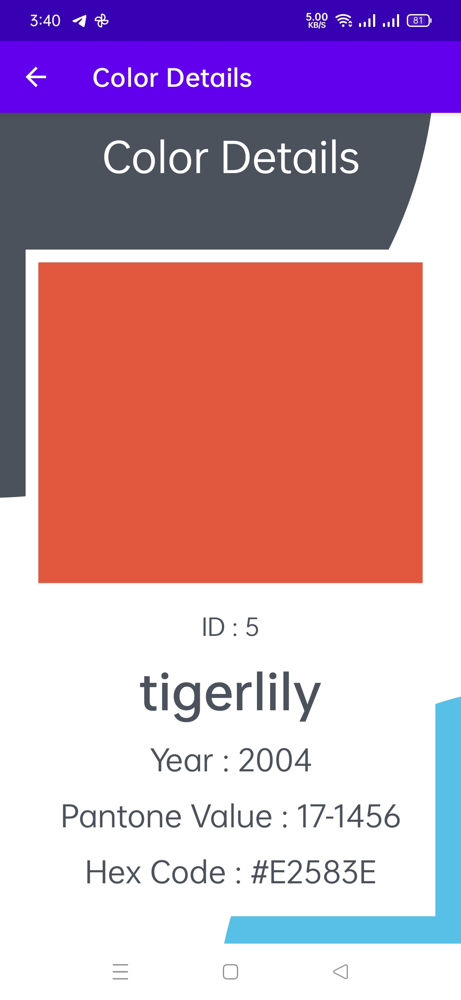

- An android application with some features like login, register, user list, color list that fetches data through a REST-API (https://reqres.in/api).
- Used retrofit for GET and POST API calls.
- Following are some screenshots from the app.

<table>
  <tr>
    <td>Login Page</td>
     <td>Register Page</td>
  </tr>
  <tr>
    <td></td>
    <td></td>
  </tr>
 </table>
 
<table>
  <tr>
    <td>Logging in with distinct emails from API</td>
     <td>Home Page</td>
     <td>User list fetched through API</td>
  </tr>
  <tr>
    <td></td>
    <td></td>
    <td></td>
  </tr>
 </table>
 
<table>
  <tr>
    <td>User details</td>
     <td>Color list fetched through API</td>
     <td>Color details</td>
  </tr>
  <tr>
    <td></td>
    <td></td>
    <td></td>
  </tr>
 </table>
